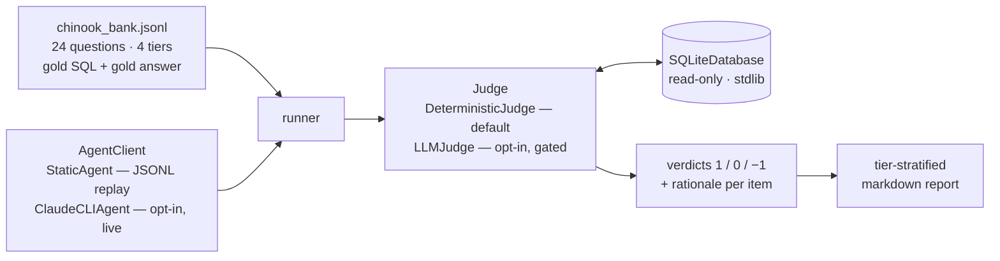

# gavel

An LLM-as-a-judge evaluation harness for text-to-SQL agents, scoring agent
answers against curated gold answers on the public
[Chinook](https://github.com/lerocha/chinook-database) sample database
(MIT licensed).

<p align="center">
  <a href="https://github.com/Zacplischka/gavel/actions/workflows/ci.yml"></a>
  
  
  
  <a href="LICENSE"></a>
</p>

<p align="center">
  <a href="#why-the-evaluation-design-is-the-product">Why</a> ·
  <a href="#quickstart">Quickstart</a> ·
  <a href="#what-the-report-looks-like">Sample report</a> ·
  <a href="#evaluating-your-own-agent">Evaluating your own agent</a> ·
  <a href="#design-decisions">Design decisions</a>
</p>

**Evaluate any text-to-SQL agent offline, for $0, with no API keys.** The
default judge is deterministic: it executes the agent's SQL and the gold SQL
against the real database and compares result tables. No LLM is consulted
unless you explicitly opt in.

> [!NOTE]
> **What this is, honestly:** This is a standalone demonstration on a public
> dataset of evaluation patterns from a production agent-benchmarking
> framework I built. It is not that system and contains none of its code or
> data. There are no third-party benchmark results, no client names, and no
> claims about other products anywhere in this repo.

## Why the evaluation design is the product

A single aggregate accuracy number lies about a text-to-SQL agent in three
distinct ways, and each design choice here closes one of them:

1. **Tier stratification — it hides *where* the agent breaks.** An agent at
   "75%" that aces lookups and fails every multi-join aggregation is a very
   different tool from one failing uniformly. Every bank question carries a
   difficulty tier (`basic` / `easy` / `medium` / `hard`) and the report is
   stratified by tier.
2. **Table-authoritative scoring — it can be talked into a pass by confident
   prose.** The default judge executes both the agent's SQL and the gold SQL
   against the live database and compares **result tables** under
   normalization. Returned table data is authoritative over prose — a
   matching table passes despite nonsense prose, and a mismatching table
   fails even when the prose parrots the gold answer verbatim. (ADR 0002)
3. **Three-valued verdicts — it forces a guess on unscorable items.**
   Verdicts are `1` (pass), `0` (fail), `-1` (cannot be scored automatically
   — manual review). The `-1` queue is its own report section, never silently
   folded into pass or fail. (ADR 0001)

## Quickstart

```bash
pip install -e '.[dev]'

# 1. Download Chinook (1 MB, SHA-256 verified)
gavel fetch

# 2. Prove the bank is sound: every gold SQL executes, every gold answer matches
gavel validate-bank

# 3. Evaluate the bundled (deliberately imperfect) baseline agent — fully offline
gavel run --agent static --predictions examples/baseline_predictions.jsonl
```

(`gavel` is the installed console script; `python -m gavel` works
identically.)

The baseline agent is intentionally flawed — cosmetic SQL differences that
should pass (aliasing, column order, `COUNT(1)`, implicit joins), subtle bugs
that should fail (missing `DISTINCT`, `>=` vs `>`, wrong sort direction,
case-sensitive filter), one syntax error, and one missing answer that lands
in the manual-review queue.

## What the report looks like

Real output from the quickstart above (committed at
[`examples/report.md`](examples/report.md)):

> ## Overall
>
> - **Items:** 24
> - **Pass:** 16
> - **Fail:** 7
> - **Manual review (verdict -1):** 1
> - **Accuracy (judged items only):** 69.6%
> - **Strict accuracy (review counts against):** 66.7%
>
> ## By tier
>
> | Tier | Items | Pass | Fail | Review | Accuracy |
> |------|------:|-----:|-----:|-------:|---------:|
> | basic | 6 | 5 | 1 | 0 | 83.3% |
> | easy | 6 | 3 | 3 | 0 | 50.0% |
> | medium | 6 | 4 | 2 | 0 | 66.7% |
> | hard | 6 | 4 | 1 | 1 | 80.0% |

Two real failure rationales from that report, because they show the design
doing its job:

> ### `e3` (easy)
>
> **Agent SQL:** `SELECT ROUND(SUM(Total), 2) FROM Invoice WHERE Total > 0.99`
>
> **Rationale:** result table does not match gold; answer prose looks right
> (similarity=0.95) but table data is authoritative over prose -> fail

The agent's prose said the right number; its SQL quietly excluded sub-dollar
invoices. Prose similarity 0.95 — still a fail, because the table decides.

> - `h6` (hard): How many customers spent more than the average customer's
>   lifetime spend?
>   - no SQL provided; cannot verify against the database -> manual review

No SQL means verdict `-1` and a spot in the manual-review queue — a missing
answer is not the same as a wrong one.

## How it works



Both the agent's SQL and the gold SQL execute against the same read-only
SQLite database; the judge compares the result tables. Zero runtime
dependencies — stdlib only. Dev deps: `pytest`, `mypy`, `ruff`.

## Evaluating your own agent

Dump your agent's outputs to JSONL — one object per bank question:

```jsonl
{"id": "m2", "sql": "SELECT g.Name, COUNT(*) ...", "answer_text": "Rock has the most tracks."}
```

| Field | Required | Meaning |
|---|---|---|
| `id` | yes | bank item id this prediction answers |
| `sql` | no | the SQL your agent produced (empty/missing ⇒ verdict `-1`) |
| `answer_text` | no | your agent's prose answer (advisory only — tables decide) |

Then:

```bash
gavel run --agent static --predictions your_predictions.jsonl \
    --out results.json --report report.md
```

Items absent from your file are judged `-1` (manual review), not `0` — a
missing answer is not the same as a wrong one.

## Optional live LLM judging (off by default, costs money)

The deterministic judge is the default and the only thing CI runs. If you
want semantic judging (e.g. to catch coincidental table equality), opt in
explicitly:

```bash
# via a local claude CLI session
gavel run --agent static --predictions ... --judge llm --judge-backend claude-cli

# via the Anthropic API (stdlib urllib, no SDK; needs ANTHROPIC_API_KEY)
gavel run --agent static --predictions ... --judge llm --judge-backend anthropic-api
```

The judge prompt enforces a semantic-equivalence rubric (formatting /
aliasing / `CURRENT_DATE`-vs-hardcoded-date differences pass; wrong tables,
filters, aggregations or joins fail) and demands one-line JSON. Unparseable
judge output becomes `-1`, never a guessed verdict. The test suite touches
none of this live — LLM parsing is covered by a recorded real response
fixture (`tests/fixtures/llm_judge_response.txt`).

There is also an optional live agent (`--agent claude-cli`) that generates
SQL from the schema, gated the same way.

## The question bank

`data/chinook_bank.jsonl` — 24 curated questions, 6 per tier:

- **basic** — single-table lookups and counts
- **easy** — aggregates and simple filters/joins
- **medium** — GROUP BY, multi-joins, ordered top-N
- **hard** — multi-join revenue rollups, HAVING with subqueries, window
  functions, nested aggregates

Gold answers are not hand-typed: they are derived by executing the gold SQL
(`gavel validate-bank --update-answers`) and CI re-verifies the derivation on
every push. Top-N questions are tie-checked against the data so the cut line
is never ambiguous.

## Development

```bash
ruff check .   # lint
mypy           # strict type-check (gavel, scripts, tests)
pytest         # offline: 86 pass + 2 skip (the 2 need the fetched Chinook DB);
               # after `gavel fetch`: all 88 pass (~0.2 s)
```

CI runs the full chain on every push: lint → mypy strict → fetch (SHA-256
verified) → validate-bank → pytest → an end-to-end run of the bundled
example.

## Design decisions

Each non-obvious choice has an ADR in [`docs/adr/`](docs/adr/):

| ADR | Decision |
|---|---|
| [0001](docs/adr/0001-three-valued-verdicts.md) | Three-valued verdicts (`1`/`0`/`-1`) with a manual-review escape hatch — never force a guess on unscorable items |
| [0002](docs/adr/0002-deterministic-table-judge.md) | Deterministic table-comparison judge as the offline default — tables authoritative over prose |
| [0003](docs/adr/0003-pluggable-db-adapters.md) | Pluggable database adapters — the `Database` protocol abstracts execution, SQLite is the bundled implementation |
| [0004](docs/adr/0004-optional-llm-judge.md) | LLM judge gated behind explicit flags — CI and the default path never spend money |

## Limitations

- **Result-table equality is necessary, not sufficient.** Two different
  queries can coincidentally agree on one data snapshot. The deterministic
  judge cannot see that; the optional LLM judge is the escape hatch.
- **One dialect per bank.** The bank is written in SQLite SQL; the adapter
  seam (ADR 0003) abstracts execution, not dialect.
- **Ordered comparison is all-or-nothing.** If the gold SQL has a top-level
  `ORDER BY`, full row order is enforced — including any tie-break the gold
  query had to impose. The committed bank avoids ties at LIMIT boundaries.
- **Float tolerance after canonical sorting** has a theoretical edge where
  near-equal values sort differently; curated gold data avoids it.
- **Prose similarity is a heuristic** (sequence ratio + containment). It is
  deliberately advisory-only, so its weakness cannot affect verdicts.

## License

MIT — see [LICENSE](LICENSE). Author: Zac Plischka <zacplischka@gmail.com>.
Chinook database © Luis Rocha, MIT licensed, fetched from the
[official releases](https://github.com/lerocha/chinook-database/releases).
